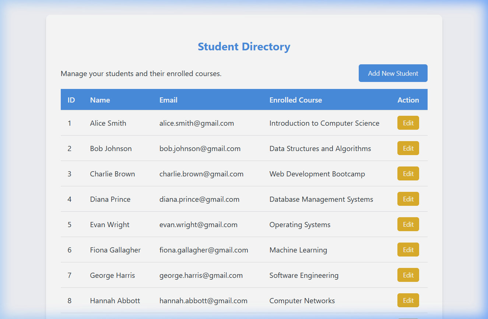
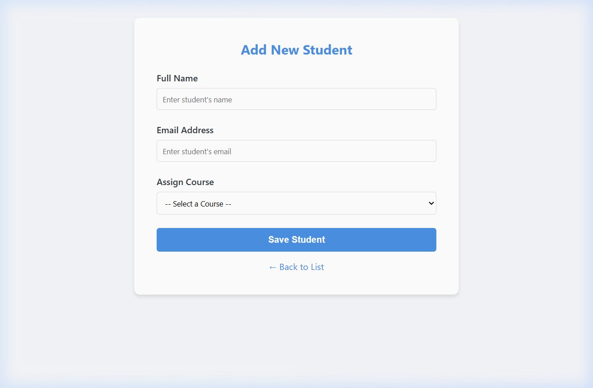
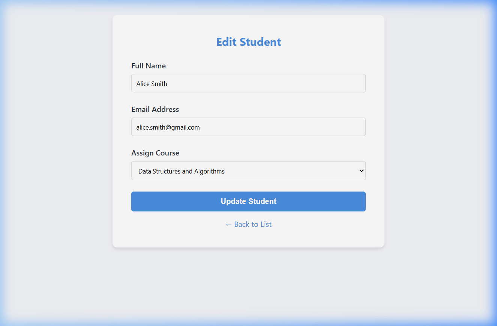
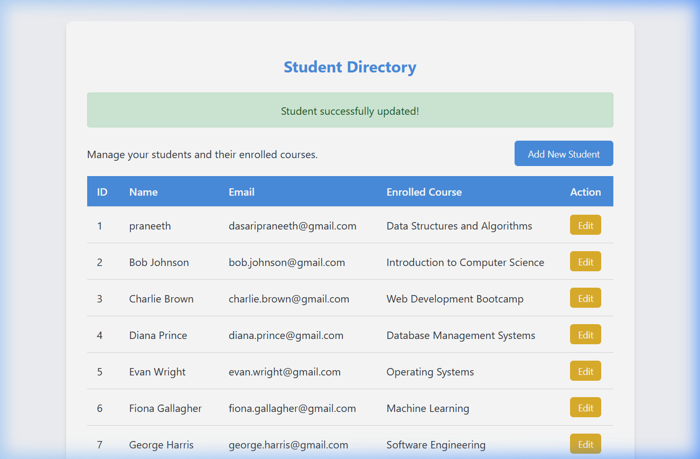

# Student Course App Documentation

## 1. Entity Relationship Design
The application manages two entities: `Student` and `Course`.
We established a **Many-To-One** relationship from `Student` to `Course`, implying that one Course can have many Students enrolled, and each Student is assigned to a single Course.

- **Course**: Contains `id` (Primary Key), `title`, and `description`.
- **Student**: Contains `id` (Primary Key), `name`, `email` (Unique), and `course_id` (Foreign Key).

## 2. Implementation Details

### Database Setup
We use an H2 in-memory database, which starts up instantly and retains data temporarily for the session. Data is auto-populated upon launch using `data.sql` to provide 10 initial sample records for both `Course` and `Student`.

### Backend Implementation
- **Repository**: Created `StudentRepository` and `CourseRepository`. A custom query using `@Query("SELECT s FROM Student s JOIN FETCH s.course")` was implemented in `StudentRepository` to fetch students along with their courses efficiently (Inner Join without N+1 problem).
- **Service Layer**: Implemented business logic in `StudentService` to abstract repository access and handle potential constraints via `DataIntegrityViolationException`. Unit tests for this layer were built using JUnit 5 and Mockito.
- **Controller**: `StudentController` sets up routes for the root (`/`) and `/students`, maps data into Spring's `Model`, and handles validation for CRUD forms.

### View Layer Implementation
- **JSP & JSTL**: Views were built with Jakarta EE 10 standards (`jakarta.tags.core`).
- **Styling**: We created an elegant vanilla CSS theme with variables (`--primary-color`, etc.), soft box-shadows, and a clean structured layout.
- Forms leverage Spring's `<form:form>` tags with binding for validation errors.

#### 1. Initial Student List

#### 2. The Form (Empty)

#### 3. Form With Data

#### 4. Final Updated List

## 3. Challenges Faced & Solutions
1. **Handling Foreign Keys in Views**: Passing course data accurately when creating/editing a student.
   - *Solution*: Leveraged `ModelAttribute` in controllers and passed the list of `Course` entities so `form:select` can map correctly.
2. **Spring Boot 3 JSP Setup**: Newer Spring Boot versions require Jakarta EE rather than Java EE packages.
   - *Solution*: Added correct dependencies (`jakarta.servlet.jsp.jstl-api` instead of legacy JSTL) in `pom.xml`.
3. **Data Integrity on Duplicates**: Preventing application crash when duplicate emails are entered.
   - *Solution*: Caught `DataIntegrityViolationException` in `StudentService` and mapped it to a friendly error message shown in the view layer via Redirect Attributes.

## 4. GitHub URL
Project Source Code: [https://github.com/praneethdasari/student-course-app](https://github.com/praneethdasari/student-course-app)
